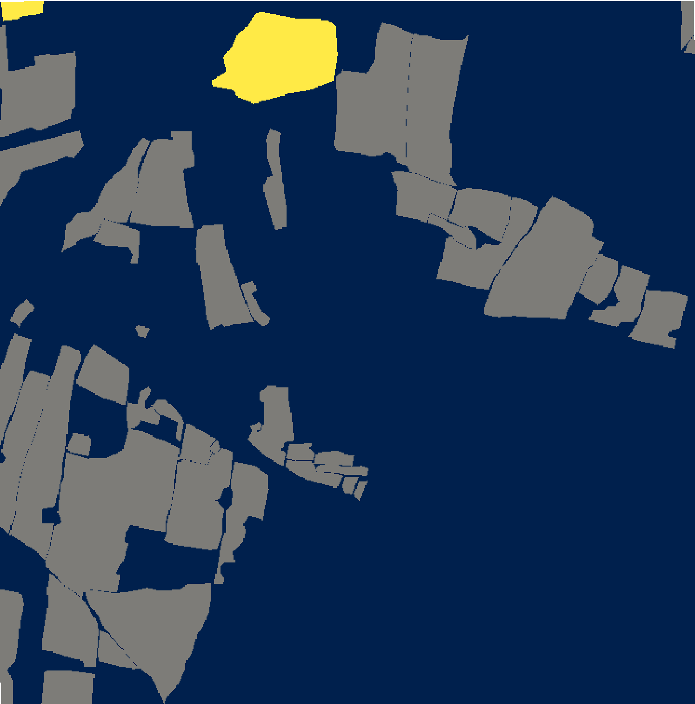
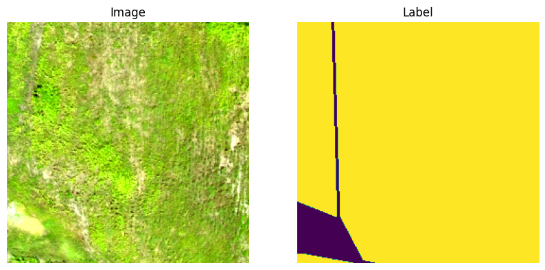
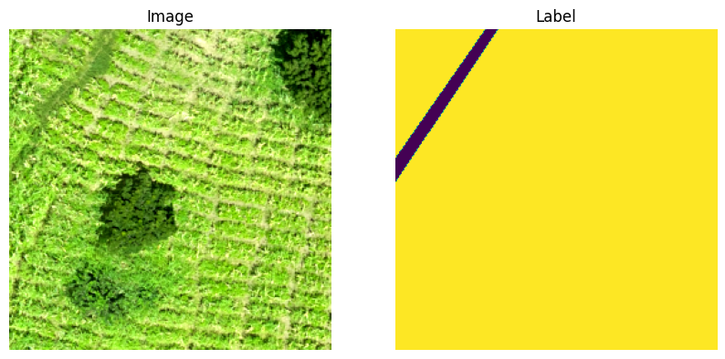

# Ghana Drone Image Processing

_Hanxi Li, Clark university_

## Intorduction

This repository contains the image processing pipeline for the Ghana Drone Images. The pipeline is for rasterize the image based on the bounding box geojson, and then create label rasters from the labels geojson and the range of bounding box, then chip it based on locations of targeting classes.

## Data

- The original data is in geotiff format
- The bounding box and crop type labels are in geojson formats
- There are a total of 182 drone image tiles
- Each dron image tiles contain 3 channels as Red, Green and Blue. However there are tiles contians the alpha channel. In this pipeline the alpha channel is ignored when processing the chips
- The primary crop types are Maize and Rice. Using one of these as the targeting crop or using both to perform multi-crop classification is recommended
- The resulting image chips are 3 * 256 * 256 by default, with overlaps of 32 pixels

## Environment Setup

- Change directory to the root directory of the cloned repo
- Make sure Conda or Miniconda is installed on your device
- RUN ```conda env create -f environment.yml```
- RUN ```jupyter lab -ip=0.0.0.0``` to launch jupyterlab
- RUN the chipping notebook form the beginning

## Features

-  User could define the primary crop type they wish to target. 
-  Both binary classification chips and multi-class classification chips are available to generate
-  Parameter "Positive_Class_threshold" is used and can be defined by the User to better filter out chips
-  Various output formats including geotiff (tif), numpy compressed file (npz) and python pickle file (pkl) are available as the output chips format

## Contribution

The original Ghana Drone Image Data, the bounding box and the labels geojson are from a existing project by Clark University and FARMERLINE. The chipping pipline code is based on a existing chipping code from Lyndon Estes and Sam Khallaghi from Clark University.

## Examples

Here is a example rasterized label tile:

- Blue: Other Crops/Non Crops
- Grey: Maize
- Yellow: Rice




Here are some example resulting image and label pairs:

- In both example there are only Maize presented





## Known Issue

- Even though the labels have 9 classes but, as suggested in the data section, using Maize or Rice, the two dominating classes is recommended when forming classification chips
- The accuracy of the labels is not 100% accuracy. To improve model performance, filter chips from different tile using the confidence level or labeler is recommended. Those information are available in the labels catalog provided
- Providing specific resolution when rasterize the image and label tiles might result in raster tiles with different number of rows and number of columns. When testing this have minor or no influence on the resulting chips but specify the number of rows and number of columns is suggested


